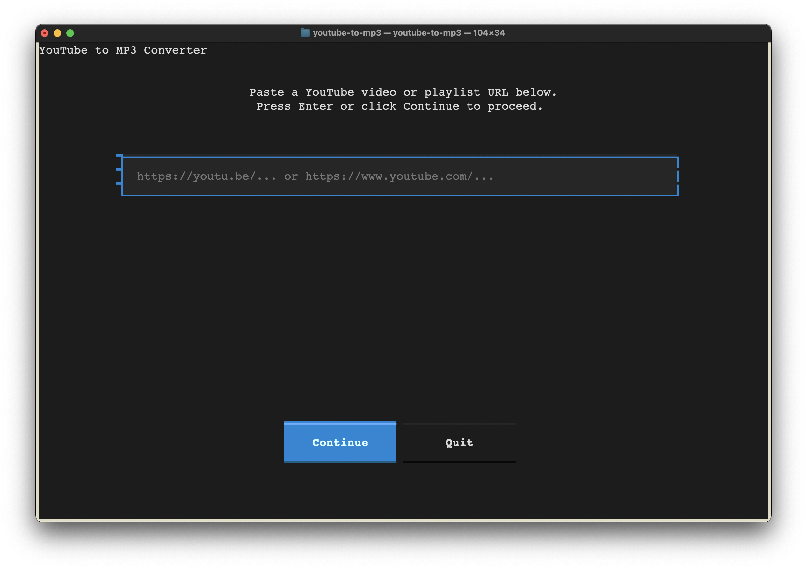

# YouTube to MP3 Converter

A command-line application for downloading YouTube videos and playlists as properly tagged MP3 files with automatic metadata extraction and album cover retrieval.



## Features

- Intelligent metadata extraction from YouTube titles
- Automatic album cover retrieval from MusicBrainz and iTunes
- Support for individual videos and playlists
- Interactive metadata review and editing
- Cross-platform compatibility (macOS, Linux, Windows)
- Rate limiting to avoid YouTube restrictions
- Professional MP3 tagging with embedded artwork

## Requirements

- Python 3.8 or higher
- FFmpeg (for audio conversion)

## Installation

```bash
git clone https://github.com/lucasld/youtube-to-mp3.git
cd youtube-to-mp3
pip install -e .
```

## Quick Start

### Interactive Mode
```bash
youtube-to-mp3
```

### Command Line Examples
```bash
# Download a single video
youtube-to-mp3 "https://youtu.be/VIDEO_ID"

# Download a playlist
youtube-to-mp3 "https://www.youtube.com/playlist?list=PLAYLIST_ID"

# Show help
youtube-to-mp3 --help
```

## Configuration

The application uses sensible defaults but can be configured via `~/.config/youtube-to-mp3/config.json`:

```json
{
  "output_directory": "~/Music/YouTube",
  "audio_quality": "192",
  "rate_limit_delay": 1.5,
  "default_genre": "Unknown"
}
```

## Output

- Files are named as `{artist} - {title}.mp3`
- MP3s include embedded metadata (artist, title, album, genre, year)
- Album covers are automatically embedded when available
- Playlists create subdirectories with the playlist name

## Troubleshooting

### FFmpeg Not Found
If you get an error about FFmpeg not being found:
- Install FFmpeg: `brew install ffmpeg` (macOS) or `sudo apt install ffmpeg` (Ubuntu)
- Ensure FFmpeg is in your PATH

### yt-dlp Issues
- Update yt-dlp: `pip install --upgrade yt-dlp`
- If downloads fail, YouTube may have changed their API - check yt-dlp releases

### Permission Errors
- Ensure the output directory exists and is writable
- Check file permissions on the output directory

## Legal & Responsible Use

This tool is provided for personal, lawful use only. By using this software, you agree to:

- Comply with all applicable local laws and YouTube's Terms of Service
- Only download content you own the rights to or have explicit permission to download
- Not use this tool to infringe copyrights or distribute copyrighted material
- Not circumvent digital rights management (DRM) or paywalls

The project does not circumvent DRM, is not affiliated with Google/YouTube, and does not endorse or facilitate copyright infringement. Usage is at your own risk. The software is provided "AS IS" without warranties of any kind.

If a rights holder raises a valid concern about content in this repository, it may be removed upon request.

## License

MIT License - see LICENSE file for details.
