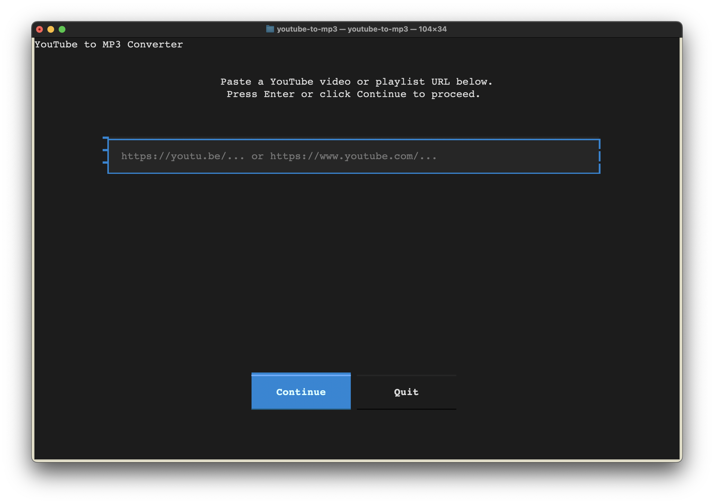

# YouTube and SoundCloud to MP3

Download a YouTube video, YouTube playlist, SoundCloud track, or SoundCloud set as tagged MP3 files. Paste the link into one input. The application detects the media service from the URL.

<p align="center">
  
</p>

## Requirements

- Python 3.10 or newer
- `ffmpeg` and `ffprobe` on `PATH`

`yt-dlp` uses FFmpeg to convert downloaded audio to MP3. Install the FFmpeg binaries through your system package manager. The Python package named `ffmpeg` is not a substitute.

## Install and run

Install the application in editable mode:

```bash
python -m pip install -e "."
```

Open the interactive interface:

```bash
ytmp3
```

`youtube-to-mp3` remains available as the longer command name.

You can also download a URL without opening the interface:

```bash
ytmp3 "https://soundcloud.com/artist/track"
```

The command accepts these options:

- `--output-dir PATH` sets the download directory.
- `--config PATH` loads a specific configuration file.
- `--debug` writes detailed information to the rotating log file.

The default output directory is `Media Downloads` inside your music directory.

## How downloads work

The application validates YouTube and SoundCloud URLs locally, then asks `yt-dlp` for track or playlist metadata. Common fields such as the title, artist, album, year, duration, and artwork use the same internal model for both services. YouTube's "Music in this video" data provides extra metadata when it is available.

Before a download starts, you can edit the extracted metadata and choose tracks from a playlist. The downloader converts the best available audio to MP3, writes ID3 tags, and retrieves missing artwork from MusicBrainz or iTunes. Existing files are not overwritten.

## Development checks

Install the development dependencies:

```bash
python -m pip install -e ".[dev]"
```

Run the checks:

```bash
pytest
ruff format --check src tests
ruff check src tests
mypy src
```

## Logs

- macOS: `~/Library/Logs/youtube-to-mp3/youtube-to-mp3.log`
- Linux: `~/.local/state/youtube-to-mp3/logs/youtube-to-mp3.log`
- Windows: `~/AppData/Local/youtube-to-mp3/logs/youtube-to-mp3.log`

Each log file grows to about 2 MB before rotation. The application keeps five backups.

## Usage note

Download only media that you own or have permission to save. Media services can change their pages and access rules, so keep `yt-dlp` current when extraction stops working.
